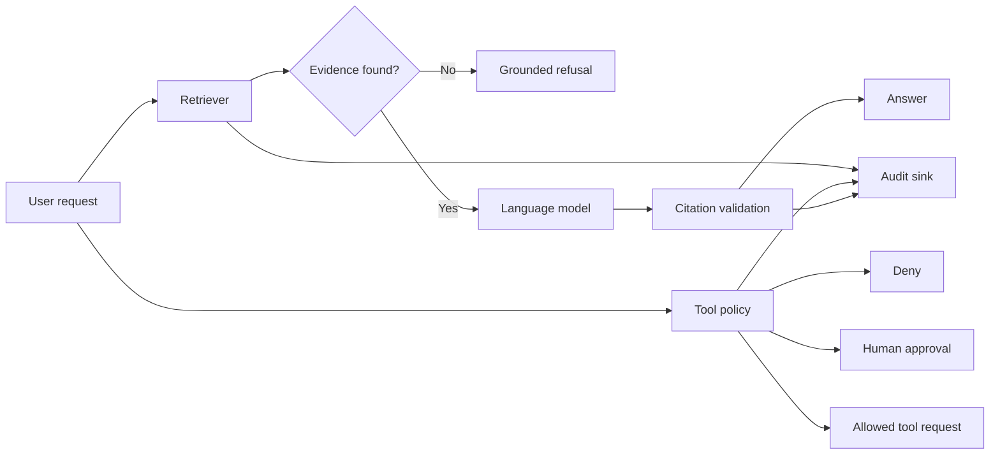

# Governed AI Agent Blueprint

**A small, executable reference architecture for grounded and auditable AI agents.**

[](https://github.com/viames/governed-ai-agent-blueprint/actions/workflows/ci.yml)
[](LICENSE)

This repository demonstrates the control boundaries an AI workflow should have
before it reaches production. It keeps model generation separate from retrieval,
policy decisions, tool approval and audit evidence.

It deliberately uses only the Python standard library. Connectors to a model,
vector store, identity provider or durable audit system belong at explicit
interfaces instead of being hidden inside the agent loop.

## What it demonstrates

- Answers grounded in retrieved records with machine-checkable citations
- Refusal when the knowledge base has no relevant evidence
- Tool allow, deny and human-approval decisions before execution
- Structured audit events without prompts, secrets or full document content
- Deterministic tests and evaluation cases independent of a model provider
- Dependency inversion through a minimal `LanguageModel` protocol

## Control flow



The blueprint produces tool decisions; it does **not** execute tools. That
separation prevents a model-generated request from becoming an external side
effect without an application-owned authorization step.

## Quick start

```sh
python3 -m unittest discover -s tests -v
python3 evals/run.py
```

Minimal usage:

```python
from governed_agent import GovernedAgent, InMemoryAuditSink, KnowledgeRecord
from governed_agent.retrieval import KeywordRetriever


class ExampleModel:
    def complete(self, question: str, context: tuple[KnowledgeRecord, ...]) -> str:
        return f"The documented recovery target is in {context[0].record_id}."


records = (
    KnowledgeRecord("runbook-7", "The recovery target is four hours."),
)
audit = InMemoryAuditSink()
agent = GovernedAgent(ExampleModel(), KeywordRetriever(records), audit)

answer = agent.answer("What is the recovery target?")
print(answer.text)
print(answer.citations)
```

## Policy model

`ToolPolicy` classifies tools into three outcomes:

| Outcome | Meaning |
| --- | --- |
| `allow` | The application may continue to its normal authorization checks |
| `approval_required` | A human or separate approval service must authorize it |
| `deny` | The request must not execute |

The default policy denies unknown tools. This is intentional: adding a tool is
a security decision, not a prompt-engineering detail.

## Repository layout

```text
src/governed_agent/   Agent, retrieval, policy and audit boundaries
tests/                Deterministic unit tests
evals/                Small executable behavior evaluation
```

## Production integration checklist

Before adapting this blueprint to production:

- authenticate the caller and propagate a stable actor identifier;
- authorize access to each retrieved record before it enters model context;
- replace keyword retrieval with a tenant-aware retrieval service;
- validate citations against the exact context supplied to the model;
- keep secrets and sensitive document content out of audit payloads;
- require idempotency keys for mutating tools;
- execute tools in a separate, least-privilege service;
- add timeouts, rate limits, cost limits and incident telemetry;
- evaluate refusal, grounding and authorization behavior on domain-specific cases.

## Non-goals

This is not a general-purpose agent framework, autonomous tool runner or claim
that deterministic wrappers make model output deterministic. It is a compact
example of where responsibility should live in a governed system.

## Security

Please report vulnerabilities privately as described in [SECURITY.md](SECURITY.md).

## License

MIT
